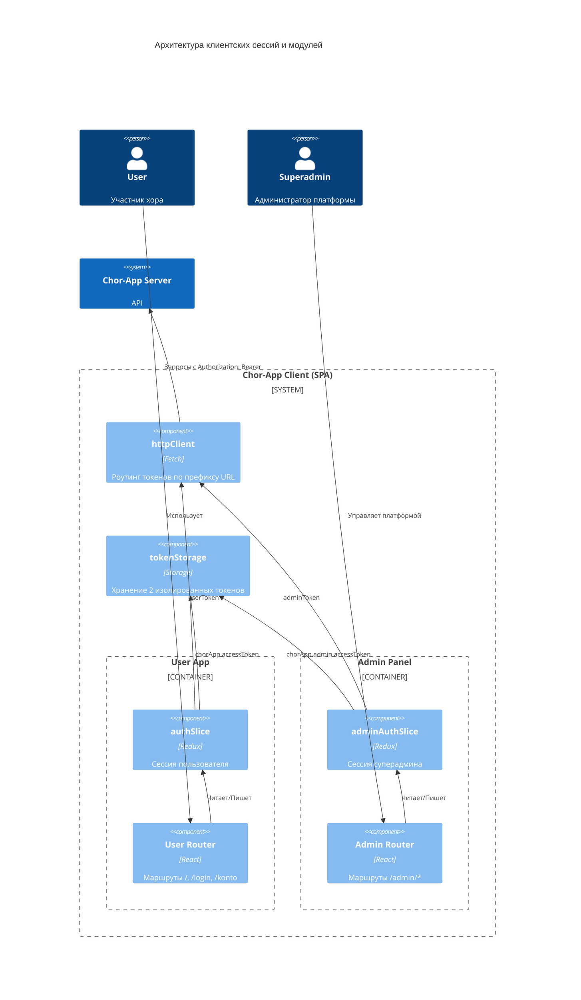
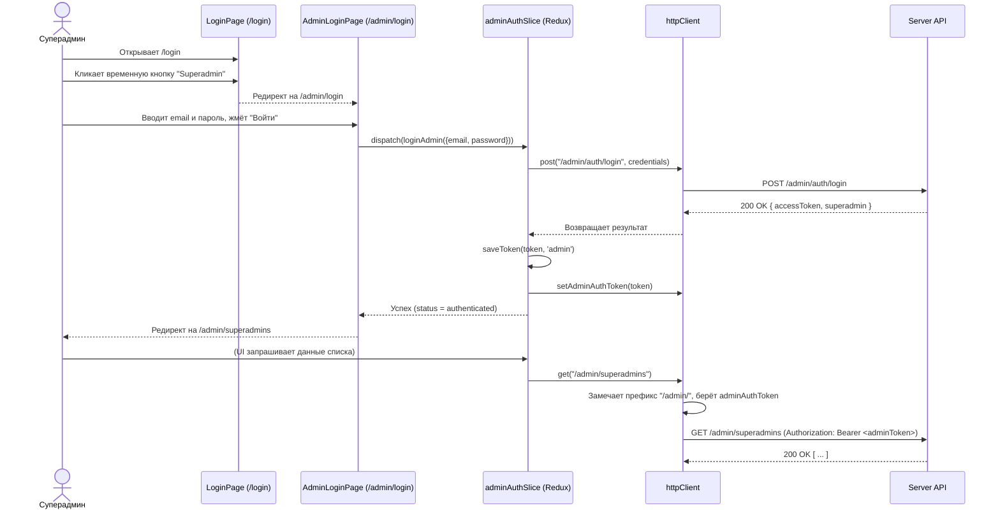

# Superadmin (клиент) — дизайн (фаза 2)

**Дата:** 2026-09-17  
**Статус:** Предложенный архитектурный дизайн  
**Основание:** Исследование (Фаза 1) в `SUPERADMIN_RESEARCH.md`, требования ADR 0001, ADR 0010, ADR 0011.

---

## 1. Архитектурный подход (Overview)

Поскольку сущности `User` и `Superadmin` полностью независимы на сервере (разные таблицы, разные токены, несовместимые `aud`), на клиенте они также должны быть **строго изолированы**.
Мы не будем пытаться объединить их в одной сессии. Вместо этого в SPA (Single Page Application) добавляется независимая подсистема (Admin Panel), которая имеет:

1. Собственное хранилище токена (`chorApp.admin.accessToken`).
2. Собственный Redux-слайс (`adminAuthSlice`).
3. Собственную иерархию маршрутов (префикс `/admin`).
4. Собственный макет (`AdminLayout`), независимый от макета пользовательского приложения.

Вход в панель суперадмина будет осуществляться через новую страницу `/admin/login`, переход на которую временно обеспечит кнопка на странице обычного входа (`/login`).

---

## 2. Модель C4 (Контейнеры и Компоненты)



---

## 3. Доработка базовой инфраструктуры

### 3.1. Хранение токенов (`tokenStorage.ts`)

Для изоляции сессий модуль хранилища будет расширен для поддержки префиксов или конкретных ключей:

- `chorApp.accessToken` — для обычного пользователя.
- `chorApp.admin.accessToken` — для суперадмина.
  Функции `saveToken`, `loadToken`, `clearToken` получат опциональный аргумент `type: 'user' | 'admin'` (по умолчанию `'user'` для обратной совместимости).

### 3.2. HTTP-клиент (`lib/http/client.ts`)

1. **Разделение токенов**: Вместо одной переменной `authToken` вводятся `userAuthToken` и `adminAuthToken`.
2. **Маршрутизация токенов**: Внутри функции `request` будет проверяться путь:
   ```typescript
   const token = path.startsWith("/admin/") ? adminAuthToken : userAuthToken
   if (token) headers.Authorization = `Bearer ${token}`
   ```
   Это гарантирует, что на административные эндпоинты никогда не улетит пользовательский токен, и наоборот (защита от 401).
3. **Новые методы**: Будут добавлены экспорты для `patch`, `put`, `delete`.
4. **Поддержка FormData**: `httpClient` будет проверять тип `body`. Если `body instanceof FormData`, заголовок `Content-Type: application/json` не добавляется (браузер сам установит `multipart/form-data` с границами), а сериализация `JSON.stringify` пропускается.
5. **Обработка ошибок**: В `parseErrorBody` и класс `HttpError` будет добавлено чтение поля `code` (string), чтобы UI мог специфично реагировать на `SUPERADMIN_LAST_REMAINING`, `SUPERADMIN_EMAIL_TAKEN` и т.д.

---

## 4. Управление состоянием (Redux)

Будет создан новый модуль `src/features/superadmin/adminAuthSlice.ts`:

- **State**: `status` (idle/loading/authenticated/unauthenticated), `admin` (тип `SuperadminView`), `remember`.
- **Thunks**:
  - `bootstrapAdmin()` (запрашивает `GET /admin/me`)
  - `loginAdmin()` (запрашивает `POST /admin/auth/login`)
  - `logoutAdmin()`
  - `changeAdminPassword()` (запрашивает `POST /admin/me/change-password`)
- **Selectors**: `selectAdminAuthStatus`, `selectAdmin`.

В `src/app/store.ts` корневой редьюсер будет расширен: `combineSlices(authSlice, adminAuthSlice)`. Приложение при старте в `App.tsx` будет вызывать и `bootstrap()`, и `bootstrapAdmin()` параллельно.

---

## 5. Маршрутизация и Guard'ы

### 5.1. Защитные компоненты

- `RequireAdminAuth.tsx` — если `adminAuthSlice` не авторизован, редирект на `/admin/login`.
- `RequireAdminGuest.tsx` — если `adminAuthSlice` авторизован, редирект на `/admin`.

### 5.2. Дерево маршрутов (`App.tsx`)

```tsx
// Временный переход из обычного логина
<Route path="/login" element={<RequireGuest><LoginPage /></RequireGuest>} />

// Административная ветка
<Route path="/admin/login" element={<RequireAdminGuest><AdminLoginPage /></RequireAdminGuest>} />

<Route path="/admin" element={<RequireAdminAuth><AdminLayout /></RequireAdminAuth>}>
  <Route index element={<Navigate to="superadmins" replace />} />

  <Route path="superadmins" element={<SuperadminsListPage />} />
  <Route path="me" element={<AdminProfilePage />} />

  {/* Будущие разделы каталога библиотеки */}
  <Route path="library/*" element={<LibraryAdminPlaceholder />} />
</Route>
```

---

## 6. Компоненты UI (Дизайн экранов)

### 6.1. Временная кнопка перехода (Требование пользователя)

В `src/features/auth/pages/LoginPage.tsx` под формой входа добавляется временная кнопка:

```tsx
<div className="mt-4 text-center border-top pt-3">
  <p className="text-muted small">Administration</p>
  <Button as={Link} to="/admin/login" variant="outline-secondary" size="sm">
    Superadmin Login
  </Button>
</div>
```

### 6.2. AdminLoginPage

- Аналогичен `LoginPage.tsx`, но:
  - Заголовок: "Superadmin Login".
  - Нет ссылок на регистрацию или "Забыли пароль" (восстановление для суперадминов через UI не предусмотрено ADR 0011).
  - Вызывает `dispatch(loginAdmin(credentials))`.

### 6.3. AdminLayout и AdminHeader

- **AdminHeader**: Шапка темного цвета (`bg="dark" data-bs-theme="dark"`) или со специфичным бэйджем "ADMIN PANEL", чтобы визуально отличать от клиентской части.
- Меню аккаунта в шапке показывает имя суперадмина, ссылку на `/admin/me` и `Abmelden` (вызывает `logoutAdmin()`).
- **TabNav (Admin)**: Вкладки "Superadmins", "Library (Каталог)".

### 6.4. SuperadminsListPage (CRUD Суперадминов)

- Вызывает `GET /admin/superadmins` через API-модуль.
- Отображает таблицу (Имя, Email, Дата создания). Справа кнопки действий: "Edit", "Change Password", "Delete" (заблокирована для собственной строки, `isCurrent === true`).
- Кнопка "Add Superadmin" открывает модальное окно с формой (Имя, Email, Пароль) -> вызывает `POST /admin/superadmins`.
- Модальное окно редактирования (Имя, Email) -> `PATCH /admin/superadmins/:id`.
- Ошибки (например, `SUPERADMIN_LAST_REMAINING`) выводятся через `FormError` / Alert благодаря пробросу `error.code`.

### 6.5. AdminProfilePage

- Отображает текущие данные (`GET /admin/me`).
- Форма редактирования имени и email -> `PATCH /admin/me`.
- Отдельный блок "Passwort ändern" (Текущий пароль, Новый пароль) -> `POST /admin/me/change-password`.

---

## 7. Sequence Diagram: Вход и маршрутизация суперадмина



---

## 8. Этапы реализации (План внедрения)

1. **HTTP Client & Storage**: Расширение `tokenStorage.ts`, добавление `setAdminAuthToken`, логики `path.startsWith('/admin/')`, методов `patch/put/delete`, обработки `FormData` и поля `code` в ошибках.
2. **Redux Slice**: Создание `adminAuthSlice.ts`, подключение к `store.ts`, вызов `bootstrapAdmin()` в `App.tsx`.
3. **Роутинг и макет**: Создание `RequireAdminAuth`, `RequireAdminGuest`, `AdminLayout`, добавление путей в `App.tsx`.
4. **Аутентификация**: Создание `AdminLoginPage`, добавление временной кнопки на `LoginPage`.
5. **Экраны управления (Admin Panel)**: Реализация `SuperadminsListPage` (CRUD) и `AdminProfilePage` с использованием нового HTTP-клиента.
