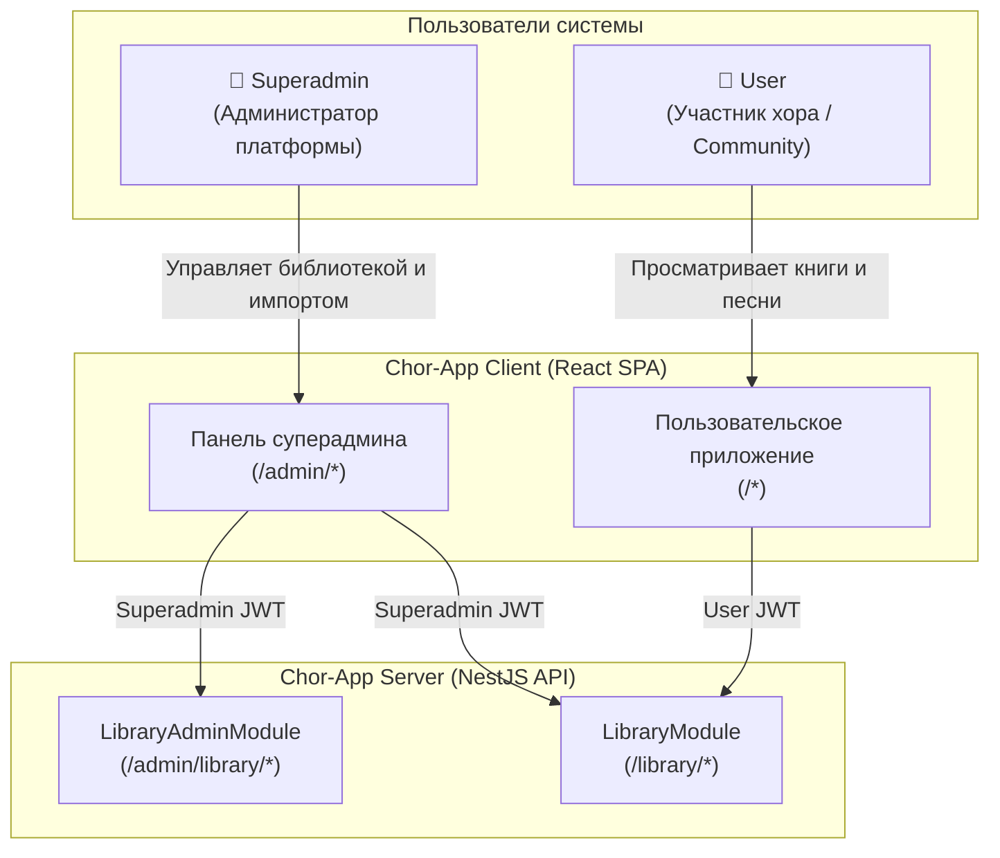
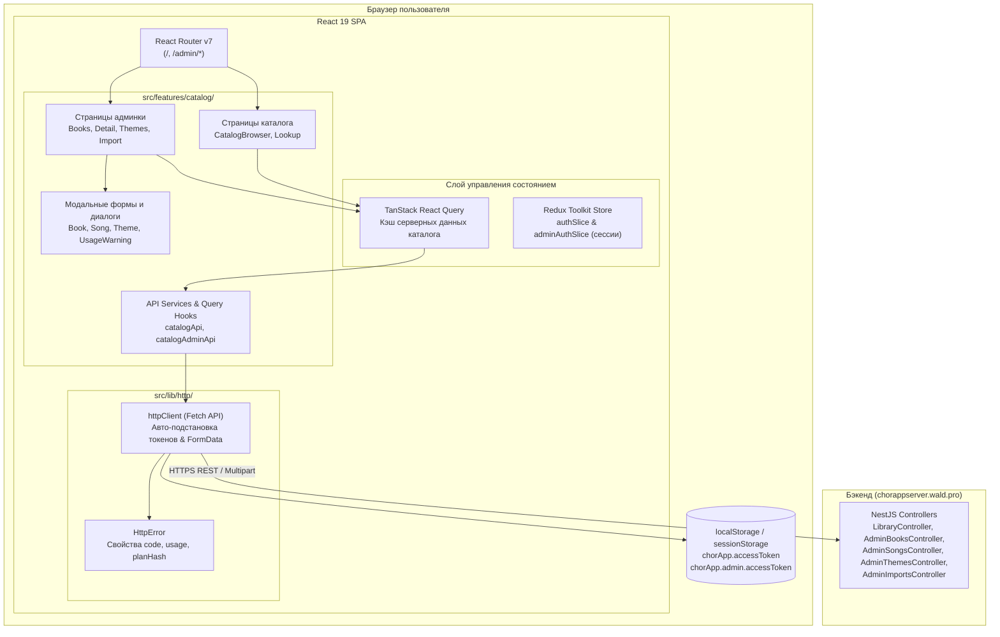
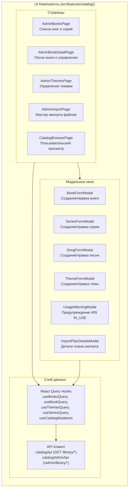
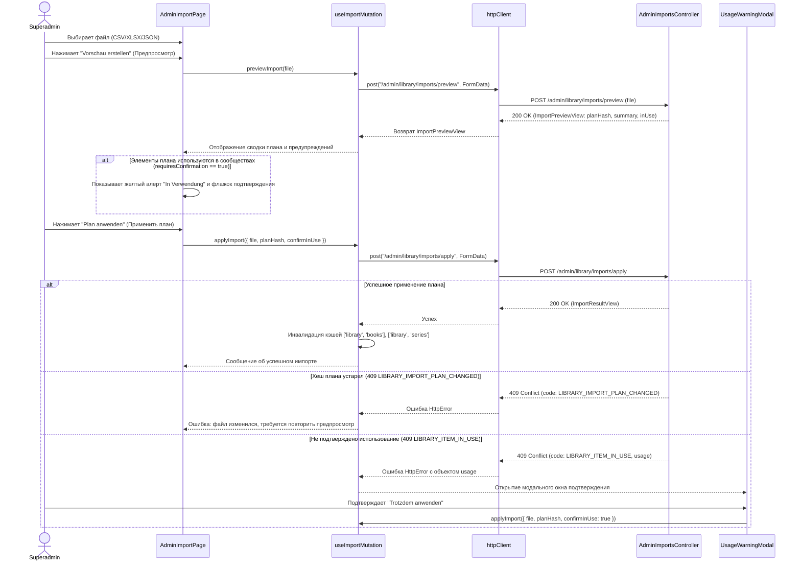
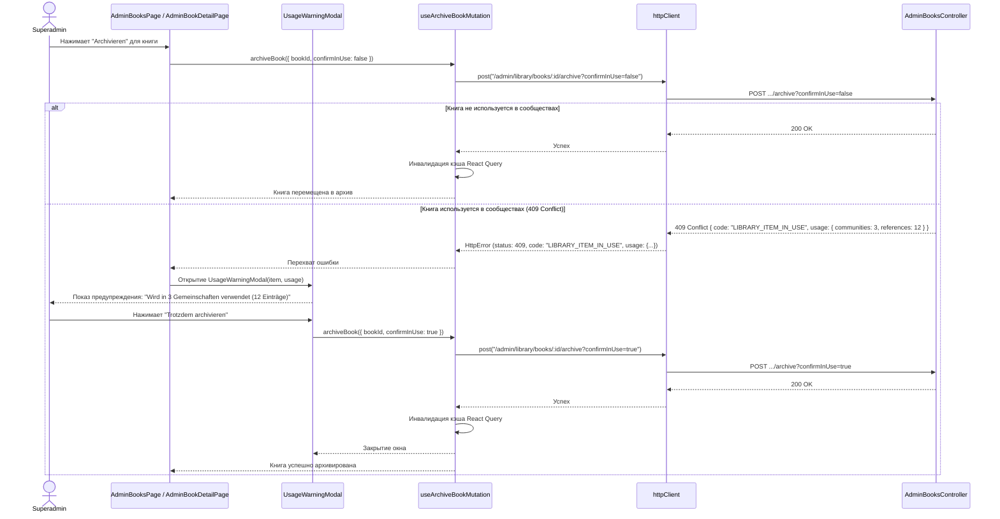

# Catalog (клиент) — дизайн (фаза 2)

**Дата:** 2026-09-17  
**Статус:** Предложенный архитектурный дизайн  
**Основание:** Исследование (Фаза 1) в [`CATALOG_RESEARCH.md`](file:///Users/alex/Desktop/apps/chor_app/chor-app-client/docs/feature/catalog/CATALOG_RESEARCH.md), нормативные решения [`0010-public-book-library.md`](file:///Users/alex/Desktop/apps/chor_app/chor-app-docs/decisions/0010-public-book-library.md), [`0011-superadmin-identity-and-session.md`](file:///Users/alex/Desktop/apps/chor_app/chor-app-docs/decisions/0011-superadmin-identity-and-session.md), [`0001-client-stack.md`](file:///Users/alex/Desktop/apps/chor_app/chor-app-docs/decisions/0001-client-stack.md), [`0009-repertoire-folders-attachments-themes.md`](file:///Users/alex/Desktop/apps/chor_app/chor-app-docs/decisions/0009-repertoire-folders-attachments-themes.md).

---

## 1. Цель и контекст решения

### 1.1. Назначение фичи

Предоставить клиентский интерфейс для глобального каталога печатных изданий (библиотеки) Chor-App в двух аспектах:

1. **Панель суперадмина (`/admin/library/*`):** полный набор инструментов управления глобальными данными библиотеки (серии книг `LibrarySeries`, книги `LibraryBook`, песни `LibrarySong`, главные темы `LibraryTheme`), двухфазный импорт файлов каталога (CSV / XLSX / JSON) с предпросмотром плана изменений и контролем хеша плана (`planHash`), а также интерактивная обработка предупреждений использования элементов в сообществах (`LIBRARY_ITEM_IN_USE`) с возможностью подтверждения архивации (`confirmInUse=true`).
2. **Пользовательский интерфейс (`GET /library/*`):** общедоступный для участников хоров просмотр печатных книг, поиск песен по номеру/названию/серии и просмотр каталога тем.

### 1.2. Архитектурные принципы

- **Соблюдение ADR 0001 (Стек):** серверные данные каталога управляются и кэшируются через **TanStack React Query** (`@tanstack/react-query`). Redux Toolkit используется только для локального состояния UI (модальные окна, фильтры, черновики форм).
- **Соблюдение ADR 0010 & ADR 0011 (Безопасность):** эндпоинты изменения каталога вызываются строго с токеном суперадмина (`aud: "chor-app-superadmin"`). Эндпоинты чтения принимают как токен пользователя, так и токен суперадмина.
- **Интеграция с UI:** единый стиль стандартного Bootstrap 5 через `react-bootstrap`, немецкий язык интерфейса (UI copy), адаптивный mobile-first дизайн.

---

## 2. Требования

### 2.1. Функциональные требования (FR)

| ID       | Требование                                                 | Описание и сценарий                                                                                                                                                                                                                                                                                                                                                                                            |
| -------- | ---------------------------------------------------------- | -------------------------------------------------------------------------------------------------------------------------------------------------------------------------------------------------------------------------------------------------------------------------------------------------------------------------------------------------------------------------------------------------------------- |
| **FR-1** | Навигация администратора библиотеки                        | В шапке суперадмина [`AdminLayout`](file:///Users/alex/Desktop/apps/chor_app/chor-app-client/src/features/superadmin/components/AdminLayout.tsx) появляется раздел **Bibliothek** с навигацией по разделам: книги и серии, главные темы, импорт каталога.                                                                                                                                                      |
| **FR-2** | Управление сериями и книгами                               | Просмотр списка книг и серий (`GET /library/books`, `GET /library/series`). Создание книги (`POST /admin/library/books`), редактирование названия/серии/тома (`PATCH /admin/library/books/:id`), создание серии (`POST /admin/library/series`), переименование серии (`PATCH /admin/library/series/:id`).                                                                                                      |
| **FR-3** | Архивация и восстановление книг и серий                    | Архивация книги (`POST /admin/library/books/:id/archive`) с подтверждением при использовании (`confirmInUse=true`), восстановление книги (`POST .../restore`). Архивация и восстановление серий (`/admin/library/series/:id/archive` и `/restore`).                                                                                                                                                            |
| **FR-4** | Управление песнями в книге                                 | Страница детального просмотра книги (`GET /library/books/:id`): таблица песен (номер, название, автор, аранжировщик, темы). Добавление песни (`POST /admin/library/books/:id/songs`), редактирование полей (`PATCH /admin/library/songs/:id`), привязка тем (`PUT /admin/library/songs/:id/themes`), архивация и восстановление.                                                                               |
| **FR-5** | Управление главными темами                                 | Просмотр списка тем (`GET /library/themes`) со счетчиком песен `songCount`. Создание темы (`POST /admin/library/themes`), переименование (`PATCH /admin/library/themes/:id`), архивация с проверкой использования (`confirmInUse=true`), восстановление (`POST .../restore`).                                                                                                                                  |
| **FR-6** | Двухфазный импорт файлов (Preview & Apply)                 | Загрузка файла `.csv`, `.xlsx` или `.json` через `multipart/form-data` на `/admin/library/imports/preview`. Отображение сводки плана, списков создаваемых, обновляемых, перемещаемых и архивируемых песен, а также предупреждения об элементах, используемых в сообществах (`inUse`). Применение плана через `/admin/library/imports/apply` с передачей сохраненного файла, `planHash` и флага `confirmInUse`. |
| **FR-7** | Модальное окно подтверждения использования (Usage Warning) | При перехвате ошибки 409 `LIBRARY_ITEM_IN_USE` отображается модальный диалог с указанием числа сообществ (`communities`) и ссылок (`references`), в которых задействован элемент, с возможностью повторить запрос с `confirmInUse=true`.                                                                                                                                                                       |
| **FR-8** | Пользовательский просмотр каталога                         | Пользовательская страница просмотра библиотеки (вкладки «Lieder verwalten» / «Themensuche» или единый браузер каталога): выбор книги, просмотр песен, поиск по номеру песни (`/library/songs/lookup`).                                                                                                                                                                                                         |

### 2.2. Нефункциональные требования (NFR)

| ID        | Требование                      | Реализация                                                                                                                                                                                                                                                   |
| --------- | ------------------------------- | ------------------------------------------------------------------------------------------------------------------------------------------------------------------------------------------------------------------------------------------------------------ |
| **NFR-1** | Серверное состояние по ADR 0001 | Установка `@tanstack/react-query`. Отсутствие хранения списков книг и песен в Redux Store. Автоматическая инвалидация кэша React Query после мутаций.                                                                                                        |
| **NFR-2** | Корректная авторизация запросов | HTTP-клиент передает `adminAuthToken` на эндпоинты `/admin/library/...`. На публичные эндпоинты `/library/...` передается токен пользователя (`userAuthToken`), а при его отсутствии и наличии сессии суперадмина — токен администратора (`adminAuthToken`). |
| **NFR-3** | Сохранение полных данных ошибок | HTTP-клиент сохраняет тело ошибки (включая `usage`, `planHash`, `errors`) в объекте ошибки [`HttpError`](file:///Users/alex/Desktop/apps/chor_app/chor-app-client/src/lib/http/httpError.ts).                                                                |
| **NFR-4** | Немецкоязычный интерфейс (UI)   | Все надписи, сообщения валидации, заголовки и диалоги выполнены на немецком языке согласно [`glossary.md`](file:///Users/alex/Desktop/apps/chor_app/chor-app-docs/glossary.md). Идентификаторы в коде — на английском языке.                                 |
| **NFR-5** | Адаптивность и доступность      | Верстка на компонентах `react-bootstrap`, корректное отображение на мобильных устройствах (`xs`) и десктопах (`md`/`lg`), спиннеры загрузки и блокировка кнопок во время сетевых операций.                                                                   |

---

## 3. Архитектурная модель C4

### 3.1. Уровень 1: Контекст системы (System Context)



---

### 3.2. Уровень 2: Контейнеры и инфраструктура (Containers)



---

### 3.3. Уровень 3: Компоненты фичи `catalog` (Components)



---

## 4. Диаграммы последовательности (Sequence Diagrams)

### 4.1. Двухфазный импорт каталога с предупреждением об использовании



---

### 4.2. Архивация сущности с проверкой использования (Usage Warning Flow)



---

## 5. Архитектурные проектные решения (Design Decisions)

### D-1: Интеграция `@tanstack/react-query` для кэширования серверных данных

- **Проблема:** В `package.json` отсутствует `@tanstack/react-query`, хотя ADR 0001 и `AGENTS.md` строго фиксируют его использование для серверных данных и запрещают RTK Query.
- **Решение:**
  1. Установить `@tanstack/react-query` (`^5.x`).
  2. В `src/main.tsx` обернуть приложение в `<QueryClientProvider client={queryClient}>`.
  3. Для фичи каталога выделить пространство ключей кэша (Query Keys):
     - `['library', 'series', { includeArchived }]`
     - `['library', 'books', { seriesId, q, includeArchived }]`
     - `['library', 'book', bookId, { includeArchivedSongs }]`
     - `['library', 'song', songId]`
     - `['library', 'themes', { includeArchived }]`
     - `['library', 'lookup', { number, bookId, seriesId }]`
  4. После мутаций (создание/изменение/архивация/импорт) выполнять адресный `queryClient.invalidateQueries`.

### D-2: Доработка `httpClient` и `HttpError` для передачи данных ошибок и токенов

- **Проблема 1:** При ошибках 409 `LIBRARY_ITEM_IN_USE`, 409 `LIBRARY_IMPORT_PLAN_CHANGED` и 400 `LIBRARY_FILE_INVALID` сервер присылает структурированные поля (`usage`, `planHash`, `errors`), которые сейчас отбрасываются парсером `client.ts`.
- **Проблема 2:** Запросы чтения `GET /library/...` защищены на сервере `UserOrSuperadminAuthGuard`, но `client.ts:102` проверяет только `path.startsWith("/admin/")` и для `/library/...` подставляет `userAuthToken`. Если суперадмин работает в панели админа без активной пользовательской сессии, запросы на чтение библиотеки возвращают 401.
- **Решение:**
  1. Расширить класс `HttpError`:
     ```typescript
     export class HttpError<TPayload = unknown> extends Error {
       readonly status: number
       readonly details: string[] | undefined
       readonly code: string | undefined
       readonly payload: TPayload | undefined
       ...
     }
     ```
  2. В `parseErrorBody` сохранять все неизвестные свойства ответа сервера в поле `payload`.
  3. В функции подстановки токена в `client.ts`:
     ```typescript
     let token: string | null = null
     if (path.startsWith("/admin/")) {
       token = adminAuthToken
     } else if (path.startsWith("/library/")) {
       // Публичная библиотека доступна как пользователю, так и суперадмину
       token = userAuthToken ?? adminAuthToken
     } else {
       token = userAuthToken
     }
     if (token) {
       headers.Authorization = `Bearer ${token}`
     }
     ```

### D-3: Структура навигации и административных экранов библиотеки

- В `AdminLayout.tsx` добавляется пункт верхнего меню **Bibliothek**.
- Страницы панели администратора:
  - `/admin/library` (редирект на `/admin/library/books`)
  - `/admin/library/books` — список книг и серий, создание книги, добавление серии, фильтрация и поиск, переход к деталям книги.
  - `/admin/library/books/:bookId` — детальный просмотр книги, таблица песен, добавление песни, редактирование реквизитов книги, архивация книги с подтверждением.
  - `/admin/library/themes` — управление главными темами каталога, переименование, создание, архивация с предупреждением использования.
  - `/admin/library/import` — интерфейс двухфазной загрузки файлов каталога.

### D-4: Модель управления состоянием файла при двухфазном импорте

- **Проблема:** Сервер выполняет импорт в две фазы: сначала `POST /imports/preview` (возвращает `planHash`), затем `POST /imports/apply` (требует повторной передачи самого файла, `planHash` и флага `confirmInUse`).
- **Решение:** На странице `AdminImportPage` выбранный пользователем объект `File` сохраняется в локальном React-состоянии (`useState<File | null>`). После получения предпросмотра пользователю отображаются результаты анализа файла и кнопка «Plan anwenden», которая берет сохраненный `File` и `planHash` и отправляет их в запрос `apply`.

### D-5: Универсальный компонент обработки предупреждений об использовании (`UsageWarningModal`)

- При архивации книги, песни или темы сервер может вернуть 409 `LIBRARY_ITEM_IN_USE`.
- Создается переиспользуемый компонент `UsageWarningModal`, который принимает:
  - `show: boolean`
  - `itemTitle: string` (название архивируемого элемента)
  - `usage: { communities: number, references: number } | null`
  - `onConfirm: () => void` (вызывает мутацию с `confirmInUse=true`)
  - `onCancel: () => void`

---

## 6. Детальная спецификация модулей и файлов

```
chor-app-client/
  package.json
  src/
    lib/
      http/
        client.ts                         # Расширение выбора токена (/library/) и извлечения payload
        httpError.ts                      # Добавление поля payload: unknown в класс HttpError
    features/
      superadmin/
        components/
          AdminLayout.tsx                 # Добавление пункта навигации "Bibliothek"
      catalog/
        types/
          catalog.types.ts                # DTO и View типы для Series, Book, Song, Theme, Import
        api/
          catalogApi.ts                   # Чтение: getSeries, getBooks, getBook, getSong, lookupSong, getThemes
          catalogAdminApi.ts              # Администрирование: CRUD для series, books, songs, themes, imports
        hooks/
          useCatalogQueries.ts            # React Query хуки для чтения каталога
          useCatalogAdminMutations.ts     # React Query хуки для админских мутаций и инвалидации
        components/
          BookFormModal.tsx               # Модальное окно создания/редактирования книги
          SeriesFormModal.tsx             # Модальное окно создания/переименования серии
          SongFormModal.tsx               # Модальное окно создания/редактирования песни
          SongThemesModal.tsx             # Модальное окно назначения тем песне
          ThemeFormModal.tsx              # Модальное окно создания/переименования темы
          UsageWarningModal.tsx           # Универсальный диалог подтверждения при 409 IN_USE
          ImportSummaryAlert.tsx          # Блок сводки результатов предпросмотра импорта
          ImportInUseList.tsx             # Список элементов, используемых сообществами, в превью импорта
        pages/
          admin/
            AdminBooksPage.tsx            # Список книг и серий с фильтрами и кнопками создания
            AdminBookDetailPage.tsx       # Детальная страница книги с таблицей песен
            AdminThemesPage.tsx           # Список главных тем каталога
            AdminImportPage.tsx           # Страница двухфазного импорта файлов
          public/
            CatalogBrowserPage.tsx        # Пользовательский просмотр каталога
    App.tsx                               # Регистрация маршрутов /admin/library/* и пользовательских вкладок
    main.tsx                              # Подключение QueryClientProvider
```

---

## 7. Спецификация экранов и UI (German Copy)

### 7.1. Административный список книг и серий (`AdminBooksPage.tsx`)

- **Заголовок:** `Bibliothek — Bücher & Serien`
- **Кнопки действий:**
  - `+ Buch anlegen` (открывает `BookFormModal`)
  - `+ Serie anlegen` (открывает `SeriesFormModal`)
  - `Importieren` (ссылка на `/admin/library/import`)
  - `Themen verwalten` (ссылка на `/admin/library/themes`)
- **Фильтры:**
  - Поле поиска по названию (`Suche nach Titel...`)
  - Выпадающий список серий (`Alle Serien`, либо конкретная серия)
  - Чекбокс `Archivierte anzeigen`
- **Таблица книг:**
  - Колонки: `Titel`, `Serie`, `Band`, `Lieder` (активных песен), `Status` (Aktiv / Archiviert), `Aktionen`.
  - Кнопки действий для строки: `Öffnen` (переход к деталям книги), `Bearbeiten` (модалка), `Archivieren` / `Wiederherstellen`.

### 7.2. Детальная страница книги (`AdminBookDetailPage.tsx`)

- **Заголовок:** `<Titel des Buches>` с бэйджем серии и тома (например, `Bücher — Band 2`).
- **Сводка:** Количество песен, статус (Aktiv / Archiviert).
- **Кнопки книги:** `Buch bearbeiten`, `Buch archivieren` / `Wiederherstellen`, `+ Lied hinzufügen`.
- **Таблица песен:**
  - Колонки: `Nr.` (номер песни), `Titel`, `Autor`, `Arrangeur`, `Themen` (список бэйджей главных тем), `Status`, `Aktionen`.
  - Кнопки песни: `Bearbeiten` (номер, название, авторы), `Themen` (выбор тем песни), `Archivieren` / `Wiederherstellen`.

### 7.3. Управление главными темами (`AdminThemesPage.tsx`)

- **Заголовок:** `Bibliothek — Hauptthemen`
- **Кнопка:** `+ Neues Thema`
- **Фильтр:** Чекбокс `Archivierte anzeigen`
- **Таблица:** `Name`, `Zugeordnete Lieder` (`songCount`), `Status`, `Aktionen` (`Umbenennen`, `Archivieren`, `Wiederherstellen`).

### 7.4. Мастер импорта каталога (`AdminImportPage.tsx`)

- **Заголовок:** `Katalog importieren`
- **Пояснение:** `Unterstützte Formate: JSON, CSV, XLSX (Excel) bis max. 5 MB. Der Import wird zuerst geprüft und erzeugt eine Vorschau aller Änderungen.`
- **Шаг 1: Выбор файла**
  - Поле выбора файла (`.json, .csv, .xlsx`)
  - Кнопка `Vorschau erstellen` (отправляет на `/admin/library/imports/preview`)
- **Шаг 2: Результаты предпросмотра (Preview)**
  - Сводная карточка (`Import-Vorschau`):
    - Серии: создано $N$, восстановлено $M$.
    - Книги: создано $N$, размещено $M$, без изменений $K$.
    - Темы: создано $N$, восстановлено $M$.
    - Песни: создано $N$, обновлено $M$, перемещено $K$, архивировано $L$, без изменений $P$.
  - Предупреждение об элементах в использовании (если `inUse.length > 0`):
    - Желтый баннер: `Achtung: Einige zu archivierende Lieder oder Bücher werden von Gemeinschaften verwendet.`
    - Список используемых элементов с указанием количества сообществ.
    - Чекбокс подтверждения: `Ich bestätige die Archivierung der verwendeten Elemente`.
  - Кнопка `Plan anwenden` (активна, если нет предупреждений либо чекбокс отмечен).

### 7.5. Модальное окно предупреждения об использовании (`UsageWarningModal.tsx`)

- **Заголовок:** `Element ist in Verwendung`
- **Содержимое:**
  - `Das Element „{title}“ wird aktuell in {communities} Gemeinschaft(en) verwendet ({references} Zuweisungen/Einträge).`
  - `Wenn Sie dieses Element archivieren, bleibt es in bestehenden Verläufen erhalten, kann jedoch nicht neu ausgewählt werden.`
- **Кнопки:**
  - `Abbrechen` (отмена действия)
  - `Trotzdem archivieren` (вариант кнопки: `danger`, вызывает запрос с `confirmInUse=true`)

---

## 8. Дерево маршрутизации (`App.tsx`)

```tsx
{
  /* Маршруты обычной пользовательской части */
}
;<Route
  path="/"
  element={
    <RequireAuth>
      <AppLayout />
    </RequireAuth>
  }
>
  {/* Существующие вкладки */}
  <Route path="themensuche" element={<CatalogBrowserPage />} />
  <Route path="lieder" element={<CatalogBrowserPage />} />
  {/* Остальные вкладки */}
</Route>

{
  /* Панель администратора */
}
;<Route
  path="/admin"
  element={
    <RequireAdminAuth>
      <AdminLayout />
    </RequireAdminAuth>
  }
>
  <Route index element={<Navigate to="superadmins" replace />} />
  <Route path="superadmins" element={<SuperadminsListPage />} />
  <Route path="me" element={<AdminProfilePage />} />

  {/* Новые разделы каталога библиотеки */}
  <Route path="library" element={<Navigate to="books" replace />} />
  <Route path="library/books" element={<AdminBooksPage />} />
  <Route path="library/books/:bookId" element={<AdminBookDetailPage />} />
  <Route path="library/themes" element={<AdminThemesPage />} />
  <Route path="library/import" element={<AdminImportPage />} />
</Route>
```

---

## 9. План этапов реализации (Planning Preview)

1. **Этап 1: Базовая инфраструктура и сетевой слой**
   - Установка и инициализация `@tanstack/react-query`.
   - Доработка `httpClient` (подстановка `adminAuthToken` на `/library/` при отсутствии пользовательского токена, поддержка передачи `payload` в `HttpError`).
   - Описание TypeScript интерфейсов и моделей (`catalog.types.ts`).
2. **Этап 2: API-слой и хуки React Query**
   - Реализация `catalogApi.ts` и `catalogAdminApi.ts`.
   - Создание хуков запросов и мутаций с автоматической инвалидацией кэшей.
3. **Этап 3: Базовые компоненты и модальные окна**
   - Разработка `UsageWarningModal.tsx`.
   - Разработка форм для книг, серий, песен и тем (`BookFormModal`, `SeriesFormModal`, `SongFormModal`, `ThemeFormModal`).
4. **Этап 4: Экраны управления книгами, сериями и песнями в админке**
   - Разработка `AdminBooksPage.tsx` и `AdminBookDetailPage.tsx`.
   - Подключение маршрутов в `App.tsx` и пункта навигации в `AdminLayout.tsx`.
5. **Этап 5: Экран управления главными темами**
   - Разработка `AdminThemesPage.tsx`.
6. **Этап 6: Мастер импорта каталога**
   - Разработка `AdminImportPage.tsx` (двухфазный импорт: превью, отображение плана, обработка `inUse` и применение).
7. **Этап 7: Пользовательский просмотр каталога**
   - Разработка `CatalogBrowserPage.tsx` и подключение к пользовательским вкладкам.
8. **Этап 8: Тестирование и верификация качества**
   - Unit и компонентные тесты экранов, мутаций, модалок и обработки ошибок.
   - Прохождение проверок `vitest`, `eslint`, `prettier` и `build`.
