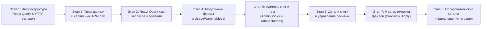

# План реализации (Фаза 3: Planning) — Catalog / Library (клиент)

**Дата:** 2026-09-17  
**Статус:** План готов к реализации  
**Основание:** Исследование [`CATALOG_RESEARCH.md`](file:///Users/alex/Desktop/apps/chor_app/chor-app-client/docs/feature/catalog/CATALOG_RESEARCH.md), архитектурный дизайн [`CATALOG_DESIGN.md`](file:///Users/alex/Desktop/apps/chor_app/chor-app-client/docs/feature/catalog/CATALOG_DESIGN.md), методология проекта [`development-process.md`](file:///Users/alex/Desktop/apps/chor_app/chor-app-docs/development-process.md) и требования [`0010-public-book-library.md`](file:///Users/alex/Desktop/apps/chor_app/chor-app-docs/decisions/0010-public-book-library.md), [`0011-superadmin-identity-and-session.md`](file:///Users/alex/Desktop/apps/chor_app/chor-app-docs/decisions/0011-superadmin-identity-and-session.md), [`0001-client-stack.md`](file:///Users/alex/Desktop/apps/chor_app/chor-app-docs/decisions/0001-client-stack.md).

---

## Правила выполнения и Quality Gates

1. **Последовательность разработки:** Реализация ведется строго одним агентом последовательно этап за этапом (без параллельных веток и субагентов).
2. **Изолированность этапов:** Каждый этап самодостаточен, покрывается тестами и завершается отдельным коммитом с чистым рабочим деревом.
3. **Обязательные Quality Gates перед каждым коммитом:**
   - Сборка TypeScript: `npm run type-check`
   - Линтер: `npm run lint` (без отключения правил)
   - Форматирование: `npm run format:check` (после `npm run format`)
   - Тесты: `npm test` (все тесты Vitest должны быть зелеными)
   - Сборка проекта: `npm run build`

---

## Карта этапов

---

## Этап 1: Инфраструктура `@tanstack/react-query` и доработка сетевого транспорта

**Цель:** Подготовить инфраструктуру серверного кэширования по ADR 0001 и устранить ограничения HTTP-клиента для работы с каталогом и ошибками использования.

**Задачи:**

1. **Установка `@tanstack/react-query`:**
   - Добавить `@tanstack/react-query` в зависимости `package.json`.
   - В `src/main.tsx` инициализировать `QueryClient` и обернуть приложение в `<QueryClientProvider client={queryClient}>`.
   - В `src/utils/test-utils.tsx` расширить хелпер `renderWithProviders` поддержкой свежего тестового `QueryClient` для изоляции тестов.
2. **Доработка `src/lib/http/httpError.ts`:**
   - Добавить в класс `HttpError<TPayload = unknown>` свойство `readonly payload: TPayload | undefined`.
   - Добавить хелпер `getErrorPayload<T>(error: unknown): T | undefined`.
3. **Доработка `src/lib/http/client.ts`:**
   - В функции `parseErrorBody` сохранять все дополнительные свойства JSON-ответа сервера (включая `usage`, `planHash`, `errors`, `existingId` и т.д.) в объекте ошибки для передачи в `HttpError.payload`.
   - В логике инъекции токена авторизации:
     - для путей, начинающихся с `/admin/`, подставлять `adminAuthToken`;
     - для путей, начинающихся с `/library/`, подставлять `userAuthToken ?? adminAuthToken` (позволяет суперадмину читать каталог в админке без отдельной пользовательской сессии);
     - для остальных путей подставлять `userAuthToken`.
4. **Тесты:**
   - Добавить unit-тесты в `src/lib/http/client.test.ts` для проверки передачи `payload`, инъекции токена для путей `/library/` и сохранения `code`/`usage`.

**Критерии приемки:**

- Зависимость `@tanstack/react-query` установлена.
- `client.ts` корректно подставляет `adminAuthToken` для `/library/...`, если `userAuthToken` равен `null`.
- Ошибки со статусом 409 и телом `{ code: "LIBRARY_ITEM_IN_USE", usage: { communities: 2, references: 5 } }` парсятся в `HttpError` с сохранением `error.code` и `error.payload.usage`.
- Все тесты проходят, линтер и форматирование чистые.

---

## Этап 2: Типы данных и сервисный API-слой каталога

**Цель:** Описать строгие TypeScript-интерфейсы и реализовать клиенты для всех публичных и административных эндпоинтов библиотеки.

**Задачи:**

1. **Создание `src/features/catalog/types/catalog.types.ts`:**
   - Типы представлений чтения (из `library.views.ts`):
     - `SeriesView`, `SeriesBookItemView`
     - `BookSummaryView`, `BookSummarySeriesView`, `BookView`, `BookSongItemView`
     - `SongView`, `SongBookRefView`, `SongThemeItemView`
     - `ThemeView`
   - Типы представлений импорта (из `import.views.ts`):
     - `ImportSummaryView`, `ImportBookSongsView`, `ImportBookPreviewView`
     - `ImportThemesPreviewView`, `ImportInUseView`, `ImportPreviewView`, `ImportResultView`
   - Типы входных данных для мутаций (Inputs / DTOs):
     - `CreateSeriesInput`, `PatchSeriesInput`
     - `CreateBookInput`, `PatchBookInput`, `ArchiveBookParams`
     - `CreateSongInput`, `PatchSongInput`, `SetSongThemesInput`, `ArchiveSongParams`
     - `CreateThemeInput`, `PatchThemeInput`, `ArchiveThemeParams`
     - `ApplyImportParams`, `PreviewImportParams`
   - Типы структурированных полезных нагрузок ошибок сервера:
     - `LibraryItemUsage`, `LibraryItemInUseErrorPayload`, `LibraryImportPlanChangedPayload`, `LibraryFileInvalidPayload`
2. **Создание `src/features/catalog/api/catalogApi.ts` (публичное чтение `GET /library/*`):**
   - `getSeries(params?: { includeArchived?: boolean }): Promise<SeriesView[]>`
   - `getBooks(params?: { seriesId?: string; q?: string; includeArchived?: boolean }): Promise<BookSummaryView[]>`
   - `getBook(bookId: string, params?: { includeArchivedSongs?: boolean }): Promise<BookView>`
   - `lookupSong(params: { number: string; bookId?: string; seriesId?: string }): Promise<SongView>`
   - `getSong(songId: string): Promise<SongView>`
   - `getThemes(params?: { includeArchived?: boolean }): Promise<ThemeView[]>`
3. **Создание `src/features/catalog/api/catalogAdminApi.ts` (администрирование `/admin/library/*`):**
   - Серии: `createSeries`, `renameSeries`, `archiveSeries`, `restoreSeries`
   - Книги: `createBook`, `patchBook`, `archiveBook`, `restoreBook`
   - Песни: `createSong`, `patchSong`, `setSongThemes`, `archiveSong`, `restoreSong`
   - Темы: `createTheme`, `renameTheme`, `archiveTheme`, `restoreTheme`
   - Импорт:
     - `previewImport(file: File): Promise<ImportPreviewView>`
     - `applyImport(params: { file: File; planHash: string; confirmInUse?: boolean }): Promise<ImportResultView>`
4. **Тесты:**
   - Написать unit-тесты `src/features/catalog/api/catalogApi.test.ts` и `catalogAdminApi.test.ts` с мокированием `httpClient`.

**Критерии приемки:**

- Все 18 эндпоинтов сервера покрыты типизированными методами вызова API.
- Вызовы `previewImport` и `applyImport` корректно конструируют `FormData` с полем `file`.
- Unit-тесты подтверждают корректность путей, HTTP-методов и структуры параметров.

---

## Этап 3: React Query хуки запросов и мутаций

**Цель:** Создать декларативный уровень взаимодействия компонентов с API через TanStack React Query с поддержкой автоматической инвалидации кэшей.

**Задачи:**

1. **Создание `src/features/catalog/hooks/useCatalogQueries.ts`:**
   - Фабрика ключей кэша `catalogQueryKeys`:
     - `series: (includeArchived?: boolean) => [...]`
     - `books: (filters?: { seriesId?: string; q?: string; includeArchived?: boolean }) => [...]`
     - `book: (bookId: string, includeArchivedSongs?: boolean) => [...]`
     - `song: (songId: string) => [...]`
     - `lookup: (params: { number: string; bookId?: string; seriesId?: string }) => [...]`
     - `themes: (includeArchived?: boolean) => [...]`
   - Хуки чтения:
     - `useSeriesListQuery`
     - `useBooksListQuery`
     - `useBookDetailQuery`
     - `useThemesListQuery`
     - `useSongLookupQuery`
2. **Создание `src/features/catalog/hooks/useCatalogAdminMutations.ts`:**
   - Хуки управления сериями (`useCreateSeriesMutation`, `useRenameSeriesMutation`, `useArchiveSeriesMutation`, `useRestoreSeriesMutation`) с инвалидацией ключей `series` и `books`.
   - Хуки управления книгами (`useCreateBookMutation`, `usePatchBookMutation`, `useArchiveBookMutation`, `useRestoreBookMutation`) с инвалидацией `books`, `series` и `book`.
   - Хуки управления песнями (`useCreateSongMutation`, `usePatchSongMutation`, `useSetSongThemesMutation`, `useArchiveSongMutation`, `useRestoreSongMutation`) с инвалидацией `book` и `themes`.
   - Хуки управления темами (`useCreateThemeMutation`, `useRenameThemeMutation`, `useArchiveThemeMutation`, `useRestoreThemeMutation`) с инвалидацией `themes` и `book`.
   - Хуки импорта (`usePreviewImportMutation`, `useApplyImportMutation`) с инвалидацией `books`, `series`, `themes`.
3. **Тесты:**
   - Написать unit-тесты `useCatalogQueries.test.tsx` и `useCatalogAdminMutations.test.tsx` с проверкой отправки запросов и инвалидации кэшей.

**Критерии приемки:**

- Хуки корректно кэшируют данные с помощью React Query.
- Мутации инвалидируют релевантные запросы после успешного выполнения.
- Обработка ошибок в хуках передает `HttpError` в UI.

---

## Этап 4: Модальные формы сущностей и диалог `UsageWarningModal`

**Цель:** Создать переиспользуемые диалоги и модальные окна для управления элементами каталога и обработки предупреждений использования.

**Задачи:**

1. **Создание `src/features/catalog/components/UsageWarningModal.tsx`:**
   - Модальный диалог на Bootstrap с вариантом кнопки `danger`.
   - Отображение информации: наименование элемента, количество использующих сообществ (`communities`), количество ссылок (`references`).
   - Кнопка «Abbrechen» и кнопка «Trotzdem archivieren» (`confirmInUse=true`).
2. **Создание `src/features/catalog/components/SeriesFormModal.tsx`:**
   - Модальное окно создания и переименования серии (`title: string`, max 200).
   - Валидация обязательного непустого названия.
3. **Создание `src/features/catalog/components/BookFormModal.tsx`:**
   - Создание и редактирование книги.
   - Поля: название (`title`), выпадающий список выбора серии (`seriesId` или «Keine Serie»), номер тома (`volume`, целое число $\ge 1$, доступно только если выбрана серия).
4. **Создание `src/features/catalog/components/ThemeFormModal.tsx`:**
   - Создание и переименование главной темы (`name: string`, max 200).
5. **Тесты:**
   - Написать компонентные тесты для каждого модального окна в `src/features/catalog/components/*.test.tsx` (проверка валидации полей, вызова callbacks, блокировки сабмита при загрузке).

**Критерии приемки:**

- Все модальные окна соответствуют German UI copy и дизайну `react-bootstrap`.
- `UsageWarningModal` наглядно отображает число сообществ и ссылок.
- Формы валидируют ввод перед отправкой.

---

## Этап 5: Страницы управления книгами и темами в админке (`AdminBooksPage`, `AdminThemesPage`)

**Цель:** Предоставить суперадмину интерфейс просмотра и управления книгами, сериями и главными темами.

**Задачи:**

1. **Навигация в `src/features/superadmin/components/AdminLayout.tsx`:**
   - Добавить пункт меню `Bibliothek` со ссылкой на `/admin/library/books`.
2. **Создание `src/features/catalog/pages/admin/AdminBooksPage.tsx`:**
   - Фильтрация: выпадающий список серий, поле поиска по названию книги, переключатель `Archivierte anzeigen`.
   - Кнопки действий: `+ Buch anlegen`, `+ Serie anlegen`, ссылки на `Themen` и `Importieren`.
   - Таблица книг: колонки `Titel`, `Serie`, `Band`, `Lieder`, `Status` (Aktiv / Archiviert), кнопки действий (`Öffnen`, `Bearbeiten`, `Archivieren` / `Wiederherstellen`).
   - Интеграция `BookFormModal`, `SeriesFormModal` и `UsageWarningModal`. При получении 409 `LIBRARY_ITEM_IN_USE` во время архивации книги автоматически открывается `UsageWarningModal`.
3. **Создание `src/features/catalog/pages/admin/AdminThemesPage.tsx`:**
   - Таблица главных тем каталога: `Name`, `Zugeordnete Lieder` (`songCount`), `Status`, действия (`Umbenennen`, `Archivieren` / `Wiederherstellen`).
   - Кнопка `+ Neues Thema`.
   - Интеграция `ThemeFormModal` и `UsageWarningModal`.
4. **Маршруты в `src/App.tsx`:**
   - Зарегистрировать `/admin/library/books` и `/admin/library/themes`.
   - Добавить редирект с `/admin/library` на `/admin/library/books`.
5. **Тесты:**
   - Написать тесты `AdminBooksPage.test.tsx` и `AdminThemesPage.test.tsx` (рендеринг списка, фильтрация, открытие модалок, реакция на 409).

**Критерии приемки:**

- Суперадмин может просматривать, создавать, редактировать, архивировать и восстанавливать книги, серии и темы.
- При архивации используемой книги открывается `UsageWarningModal` с верными счетчиками.
- Все ссылки в `AdminLayout` работают корректно.

---

## Этап 6: Страница детального просмотра книги и управление песнями (`AdminBookDetailPage`)

**Цель:** Реализовать управление песнями внутри книги печатного издания.

**Задачи:**

1. **Создание `src/features/catalog/components/SongFormModal.tsx`:**
   - Модальное окно добавления и редактирования песни.
   - Поля: номер (`number: string`), название (`title`), автор (`author`), аранжировщик (`arranger`). При создании доступен выбор начальных тем.
2. **Создание `src/features/catalog/components/SongThemesModal.tsx`:**
   - Диалог назначения тем песне (`PUT /admin/library/songs/:id/themes`): список доступных тем каталога с чекбоксами для быстрого выбора.
3. **Создание `src/features/catalog/pages/admin/AdminBookDetailPage.tsx`:**
   - Заголовок с названием книги, бэйджем серии и тома, общим числом песен и статусом архивации.
   - Кнопки управления книгой: `Bearbeiten`, `Archivieren` / `Wiederherstellen`, `+ Lied hinzufügen`.
   - Таблица песен: `Nr.`, `Titel`, `Autor`, `Arrangeur`, `Themen` (список бэйджей тем), `Status`, действия (`Bearbeiten`, `Themen`, `Archivieren` / `Wiederherstellen`).
   - Переключатель `Archivierte Lieder anzeigen`.
   - Интеграция `SongFormModal`, `SongThemesModal` и `UsageWarningModal` (при архивации песни, используемой в сообществах).
4. **Маршрут в `src/App.tsx`:**
   - Зарегистрировать `/admin/library/books/:bookId`.
5. **Тесты:**
   - Написать тесты `AdminBookDetailPage.test.tsx` (загрузка книги, список песен, добавление песни, изменение тем, архивация песни).

**Критерии приемки:**

- Суперадмин видит полный список песен книги с их темами и авторами.
- Возможность добавлять песню, редактировать ее поля и менять привязанные темы.
- Попытка архивации песни, используемой в сообществах, перехватывается модальным окном предупреждения с возможностью подтверждения.

---

## Этап 7: Мастер двухфазного импорта каталога (`AdminImportPage`)

**Цель:** Предоставить полнофункциональный интерфейс импорта каталогов из файлов CSV, XLSX и JSON с предпросмотром плана, защитой от случайной архивации и сверкой `planHash`.

**Задачи:**

1. **Создание компонентов отображения плана:**
   - `src/features/catalog/components/ImportSummaryAlert.tsx`: карточка со сводной статистикой плана (создаваемые, обновляемые, восстанавливаемые, перемещаемые, архивируемые элементы).
   - `src/features/catalog/components/ImportInUseList.tsx`: предупреждающий блок со списком используемых элементов (`inUse: ImportInUseView[]`).
2. **Создание `src/features/catalog/pages/admin/AdminImportPage.tsx`:**
   - **Шаг 1 (Выбор файла):** Drag-and-drop зона или выбор файла `.csv`, `.xlsx`, `.json` (до 5 МБ). Кнопка «Vorschau erstellen».
   - **Шаг 2 (Анализ и предпросмотр):** Отображение результатов вызова `/preview`:
     - Сводка `summary` по сериям, книгам, темам и песням;
     - Детальный аккордеон книг с индикацией создаваемых, обновляемых и перемещаемых номеров песен;
     - Список тем;
     - Если `requiresConfirmation === true` (есть используемые элементы в `inUse`): отображение предупреждения и чекбокса `Ich bestätige die Archivierung der verwendeten Elemente`.
   - **Шаг 3 (Применение):** Кнопка «Plan anwenden» отправляет `POST /admin/library/imports/apply` с объектом `File`, сохраненным `planHash` и флагом `confirmInUse`.
   - **Обработка ошибок:**
     - 400 `LIBRARY_FILE_INVALID`: вывод детального списка ошибок валидации строк файла (`errors: [{ line, message }]`).
     - 409 `LIBRARY_IMPORT_PLAN_CHANGED`: уведомление о том, что файл изменился, с предложением повторить предпросмотр.
     - 409 `LIBRARY_ITEM_IN_USE`: предупреждение о необходимости подтвердить архивацию.
3. **Маршрут в `src/App.tsx`:**
   - Зарегистрировать `/admin/library/import`.
4. **Тесты:**
   - Написать тесты `AdminImportPage.test.tsx` (выбор файла, отправка preview, отображение плана, обработка ошибок, вызов apply).

**Критерии приемки:**

- Мастер импорта корректно выполняет двухфазный процесс.
- Превью наглядно показывает все планируемые изменения.
- Блокировка применения при наличии используемых элементов без явного чекбокса подтверждения.
- Автоматическая инвалидация кэшей книг и тем после применения импорта.

---

## Этап 8: Пользовательский просмотр каталога (`CatalogBrowserPage`) и сквозное тестирование

**Цель:** Реализовать просмотр библиотеки для обычных пользователей хоров и провести сквозное тестирование всех сценариев.

**Задачи:**

1. **Создание `src/features/catalog/pages/public/CatalogBrowserPage.tsx`:**
   - Просмотр каталога для пользователей: выбор книги, поиск песен по названию или номеру, фильтрация по главным темам.
   - Быстрый поиск песни по номеру (`Lookup`) с отображением книги и тома.
2. **Подключение вкладок в `src/App.tsx`:**
   - Заменить `PlaceholderPage` во вкладках `themensuche` и `lieder` на `CatalogBrowserPage` (с предустановленным активным режимом поиска или просмотра).
3. **Интеграционные и сквозные тесты:**
   - Написать тесты сценариев `CatalogBrowserPage.test.tsx`.
   - Провести сквозную проверку пользовательских путей и админ-панели.
4. **Финальная проверка Quality Gates:**
   - `npm run type-check`
   - `npm run lint`
   - `npm run format:check`
   - `npm test`
   - `npm run build`

**Критерии приемки:**

- Пользователи могут просматривать книги и песни каталога.
- Полный набор тестов во всех модулях зеленый.
- Все линтеры и форматирование проходят без единого предупреждения.
- Проект успешно собирается для продакшена (`npm run build`).
