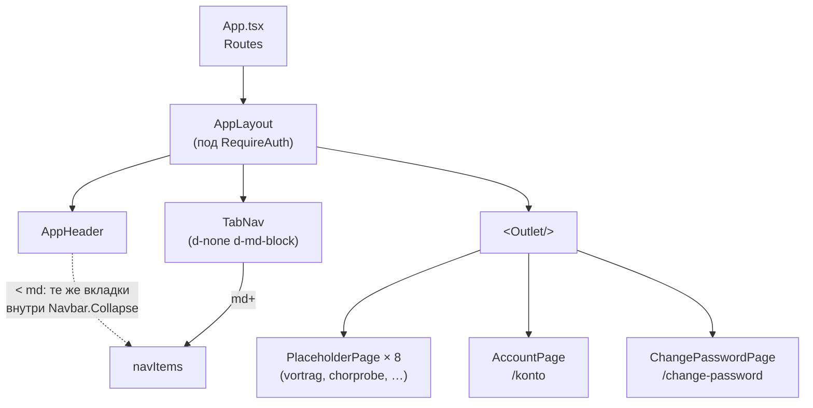

# Дашборд-шелл и адаптивная навигация

**Дата:** 2026-09-16
**Статус:** реализовано
**Тип документа:** ретроспективное описание. Фича не проходила через фазы
research/design/plan из `../../../chor-app-docs/development-process.md` —
это чисто клиентская обвязка (роутинг/layout), без новых доменных
сущностей и без изменений в `chor-app-server`; сделана напрямую в диалоге
с пользователем. Документ фиксирует, что получилось и почему, для тех, кто
будет её продолжать (в первую очередь — заменять `PlaceholderPage`
реальными разделами по мере готовности capability на бэкенде).

---

## 1. Зачем

До этой фичи `/` после логина показывал только карточку «Willkommen»
(бывший `HomePage`) без навигации по разделам приложения. Нужно было:

1. После успешного логина/регистрации вести пользователя на экран,
   по составу разделов близкий к прототипу
   (`../../../chor-app-docs/chor-app_v3.html`, `#tabNav`) — то есть на
   набор вкладок, а не на карточку-заглушку.
2. Дать доступ к данным аккаунта через адаптивную шапку (header),
   работающую mobile-first, как того требует
   `../../AGENTS.md` (Stack & tooling → Mobile-first) и ADR
   `../../../chor-app-docs/decisions/0001-client-stack.md`.
3. На мобильных экранах сами вкладки должны не отъедать постоянно место
   на экране, а убираться в выпадающее меню шапки.

## 2. Состав вкладок — не 1:1 с прототипом

Прототип показывает 11 кнопок в `#tabNav`. Взят не буквальный список, а
целевой состав разделов, уже зафиксированный в
`../../../chor-app-docs/capability-breakdown.md` и
`../../../chor-app-docs/glossary.md`:

| Прототип (`chor-app_v3.html`)            | Новый таб                 | Почему                                                                                                                                                                           |
| ---------------------------------------- | ------------------------- | -------------------------------------------------------------------------------------------------------------------------------------------------------------------------------- |
| Vortrag                                  | Vortrag                   | без изменений                                                                                                                                                                    |
| Chorprobe                                | Chorprobe                 | без изменений                                                                                                                                                                    |
| Verlauf                                  | Verlauf                   | без изменений                                                                                                                                                                    |
| Auswertung                               | Auswertung                | без изменений                                                                                                                                                                    |
| Klavierspieler + Dirigenten + Verwaltung | **Verwaltung** (один таб) | `capability-breakdown.md` объединяет их в одну capability **People**; `glossary.md` прямо фиксирует «Personen verwalten (replaces legacy "Klavierspieler/Dirigenten verwalten")» |
| Abwesenheiten                            | Abwesenheiten             | без изменений                                                                                                                                                                    |
| Themensuche                              | Themensuche               | без изменений                                                                                                                                                                    |
| Lieder verwalten                         | Lieder verwalten          | без изменений                                                                                                                                                                    |
| Daten & Backup                           | _(убран)_                 | персистентность теперь на сервере; `capability-breakdown.md` («Open points») прямо говорит, что backup — не отдельная capability нового приложения                               |

Итог — 8 вкладок вместо 11: `Vortrag`, `Chorprobe`, `Verlauf`,
`Auswertung`, `Verwaltung`, `Abwesenheiten`, `Themensuche`,
`Lieder verwalten`. Список — единственный источник истины в
`src/app/layout/navItems.ts`; заголовки и описания там взяты из реальных
`<h2>` соответствующих секций прототипа.

Ни одна из capability за этими вкладками (кроме auth) пока не
реализована на `chor-app-server` — см. порядок реализации в
`capability-breakdown.md` («Suggested implementation order»). Поэтому
каждый таб сейчас — `PlaceholderPage` с заголовком/описанием и пометкой
«в разработке», а не рабочий раздел.

## 3. Компоненты

```
src/app/layout/
  navItems.ts     — единый список вкладок (path, label, description)
  AppHeader.tsx   — адаптивная шапка: бренд, гамбургер, аккаунт-дропдаун;
                    < md также рендерит сами вкладки внутри меню
  TabNav.tsx      — горизонтальная полоса вкладок, видна только от `md`
  AppLayout.tsx   — AppHeader + TabNav + <Outlet/>, шелл для всех
                    авторизованных маршрутов

src/pages/
  AccountPage.tsx     — бывший HomePage: данные аккаунта, список Community
                        с ролью, «Passwort ändern», «Abmelden». Маршрут
                        `/konto`
  PlaceholderPage.tsx — общий компонент-заглушка для ещё не реализованных
                        разделов (title + description + Alert)
```



## 4. Поведение по брейкпоинтам (mobile-first)

- **< `md`** — `TabNav` не рендерит содержимое (`d-none d-md-block`).
  Сами вкладки показываются внутри `AppHeader`'а, в `Navbar.Collapse`,
  под гамбургером: сначала список табов (`<Nav className="d-md-none">`),
  затем разделитель `<hr className="d-md-none">`, затем аккаунт-дропдаун.
- **`md` и шире** — тот же блок табов в шапке скрыт (`d-md-none`), зато
  видна отдельная `TabNav` — горизонтальная полоса под шапкой
  (`overflow-x-auto`, `flex-nowrap`, `text-nowrap`), ближе всего к
  прототипу.
- `Navbar` в `AppHeader` держит **контролируемое** состояние `expanded`
  (`useState` + `onToggle`): клик по табу, по «Konto» или по «Abmelden»
  вызывает `closeMenu()`. Без этого раскрытое мобильное меню оставалось
  бы открытым поверх уже сменившейся страницы.
- Никакого кастомного CSS — только Bootstrap-утилиты (`d-none`,
  `d-md-none`, `d-md-block`, `ms-auto`, `overflow-x-auto`,
  `flex-nowrap`) поверх стандартных `Navbar`/`Nav`/`NavDropdown` из
  react-bootstrap, как требует `../../AGENTS.md` (Stack & tooling).

## 5. Маршруты (`src/App.tsx`)

Всё под `RequireAuth`, родительский путь `/`:

| Путь                                                                                                            | Элемент                                                                                                            |
| --------------------------------------------------------------------------------------------------------------- | ------------------------------------------------------------------------------------------------------------------ |
| `/` (index)                                                                                                     | `<Navigate to="vortrag" replace />` — дефолтная вкладка, как активная по умолчанию `eintragen`/Vortrag в прототипе |
| `/vortrag`, `/chorprobe`, `/verlauf`, `/auswertung`, `/verwaltung`, `/abwesenheiten`, `/themensuche`, `/lieder` | `<PlaceholderPage title=… description=…/>`, сгенерированы циклом по `navItems`                                     |
| `/konto`                                                                                                        | `AccountPage`                                                                                                      |
| `/change-password`                                                                                              | `ChangePasswordPage` (без изменений, путь тот же, что и раньше)                                                    |

## 6. Ключевые решения

| #   | Решение                                                                                                             | Почему                                                                                                                                                                                        |
| --- | ------------------------------------------------------------------------------------------------------------------- | --------------------------------------------------------------------------------------------------------------------------------------------------------------------------------------------- |
| D1  | 8 вкладок вместо 11 (раздел 2)                                                                                      | следование уже принятому `capability-breakdown.md`/`glossary.md`, а не буквальному прототипу                                                                                                  |
| D2  | Каждая вкладка — `PlaceholderPage`, не фейковые данные                                                              | ни одна capability за ними не реализована на сервере; фейковый функционал создал бы данные, которых нет, и его пришлось бы выкидывать                                                         |
| D3  | Раздельные реализации для `md+` (полоса `TabNav`) и `< md` (список в шапке) вместо одного универсального компонента | на десктопе полоса ближе к прототипу и не занимает место в выпадающем меню; на мобильном полоса из 8 кнопок либо скроллится вбок, либо переносится — оба варианта хуже единого гамбургер-меню |
| D4  | `HomePage` → переименован в `AccountPage`, а не создан отдельный новый компонент                                    | контент (имя, email, список Community, смена пароля, выход) уже был реализован и покрыт — просто сменилось назначение экрана                                                                  |
| D5  | `Nav.Link as={NavLink}` без кастомного `className`                                                                  | react-router сам вешает класс `active`, Bootstrap 5.3 сам стилизует `.nav-link.active` — активное состояние получено бесплатно                                                                |
| D6  | Контролируемый `expanded` у `Navbar`                                                                                | иначе мобильное меню не закрывается при переходе по ссылке (react-bootstrap этого не делает сам)                                                                                              |
| D7  | Только Bootstrap-утилиты, ноль кастомного CSS                                                                       | явное требование `../../AGENTS.md` (Stack & tooling)                                                                                                                                          |

## 7. Как заменить заглушку на реальный раздел

Когда очередная capability из `capability-breakdown.md` реализована на
`chor-app-server`, а на клиенте появляется её страница (например,
`src/features/people/pages/PeoplePage.tsx`):

1. В `App.tsx` заменить `element={<PlaceholderPage .../>}` для нужного
   `item.path` на реальный элемент (`<PeoplePage />`).
2. `navItems.ts` менять не нужно — `path`/`label` остаются те же, если
   немецкое название раздела не поменялось по сравнению с
   `glossary.md`.
3. Остальные вкладки (`AppLayout`, `AppHeader`, `TabNav`) не трогаются.

## 8. Вне рамок этой фичи

- Реальный функционал разделов (Vortrag, Chorprobe, Verlauf, Auswertung,
  Verwaltung, Abwesenheiten, Themensuche, Lieder verwalten) — ждёt
  реализации соответствующих capability на сервере
  (`capability-breakdown.md`, «Suggested implementation order»).
- Переключатель активной Community — пока не нужен, см.
  `../../AGENTS.md` («No Community-scoped feature exists yet»).
- Тёмная тема / переключатель темы, который есть в прототипе
  (`themeToggle`), — не переносился, не запрашивался.
- Локализация (i18n-библиотека vs. хардкод немецкого текста) — открытый
  вопрос, см. `../../../chor-app-docs/glossary.md` («Open follow-up»).

## 9. Проверка

- `npm run lint`, `type-check`, `test`, `build` — зелёные после каждого
  изменения (базовый шелл и мобильное поведение проверялись отдельно).
- Ручная проверка в реальном браузере (headless Chromium через
  Playwright, `chor-app-server` не поднимался — застаблены только
  `POST /auth/login` и `GET /auth/me`, весь остальной код — настоящий):
  вход → `/vortrag` с активным табом → открытие аккаунт-дропдауна →
  `/konto` → переключение вкладок → ширина 390px (гамбургер, все вкладки
  и аккаунт внутри меню, тап закрывает меню и переключает вкладку) →
  ширина 1280px (полоса вкладок отдельно от шапки, как было). Ошибок в
  консоли браузера не возникло. Скриншоты — часть прогона, в репозиторий
  не сохранялись.

## 10. Затронутые файлы

**Новые:**

- `src/app/layout/navItems.ts`
- `src/app/layout/AppHeader.tsx`
- `src/app/layout/TabNav.tsx`
- `src/app/layout/AppLayout.tsx`
- `src/pages/AccountPage.tsx`
- `src/pages/PlaceholderPage.tsx`
- `docs/feature/dashboard-shell/DASHBOARD_SHELL.md` (этот файл)

**Изменённые:**

- `src/App.tsx` — маршрутизация под `AppLayout`, генерация вкладок из
  `navItems`

**Удалённые:**

- `src/pages/HomePage.tsx` — заменён `AccountPage.tsx`
